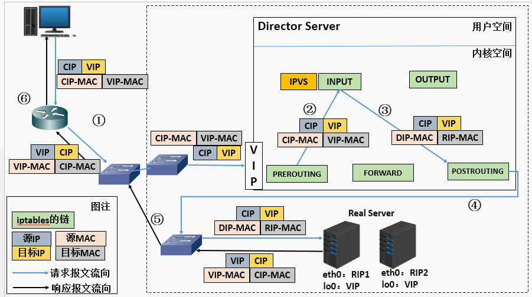

### 常用的开源软件
* lvs https://blog.csdn.net/Ki8Qzvka6Gz4n450m/article/details/79119665
* nginx
* haproxy
### 硬件设备
* F5
* NetScale
### 详细介绍
#### lvs
lvs（linux virtual server）linux虚拟服务器，他是linux内核标准的一部分，分为内核空间的ipvs（负责真正生效调度代码）和用户层的ipvsadmin（负责为ipvs编写规则）。lvs架构分为逻辑上分为调度层、服务层、共享存储，lvs集群把请求直接分发到Direct Server（调度层）上，DS根据设置的调度算法智能均衡的把请求分发到真正的服务器（服务层），使用共享存储保证请求的数据统一。
基本原理：
(a). 当用户请求到达Director Server，此时请求的数据报文会先到内核空间的PREROUTING链。 此时报文的源IP为CIP，目标IP为VIP
(b). PREROUTING检查发现数据包的目标IP是本机，将数据包送至INPUT链
(c). IPVS比对数据包请求的服务是否为集群服务，若是，修改数据包的目标IP地址为后端服务器IP，然后将数据包发至POSTROUTING链。 此时报文的源IP为CIP，目标IP为RIP
(d). POSTROUTING链通过选路，将数据包发送给Real Server
(e). Real Server比对发现目标为自己的IP，开始构建响应报文发回给Director Server。 此时报文的源IP为RIP，目标IP为CIP
(f). Director Server在响应客户端前，此时会将源IP地址修改为自己的VIP地址，然后响应给客户端。 此时报文的源IP为VIP，目标IP为CIP
1. LVS-NAT工作原理

缺点：请求的分发和返回都是通过Ds，ds压力比较大
2. LVS-DS工作原理

rs和ds必须在同一个机房

3. LVS/Tun工作原理

4. 调度算法

