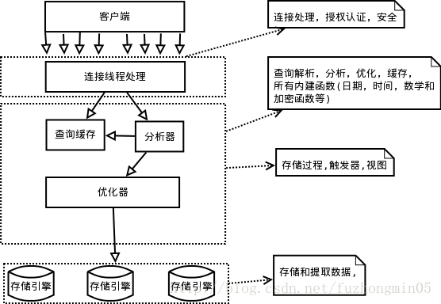

# 一、mysql 的历史
# 二、mysql架构
* Mysql服务器逻辑架构

    

    1. 客户端连接；连接处理、认证、授权、线程管理，每个连接在服务器中拥有一个线程，服务器会对连接进行认证
    2. 服务层；服务和查询执行引擎，负责查询解析、分析、优化、缓存、内置函数、存储过程、触发器、视图等跨存储引擎的功能，服务层通过API和存储引擎通信。
    3. 存储引擎；数据的存储和提取，存储引擎通过实现了服务层的接口屏蔽了不同存储引擎间的差异
* 并发
1. 读写锁
    1. 读锁（共享锁）
    2. 写锁（排它锁）
2. 锁粒度
    1. 表锁
    2. 行锁
3. 事务
    1. 开启事务sql语句
    `start transaction;`
    (……sql)
    `commit`
    2. ACID
    原子性（Atomicity):事务要不全部执行、要不全部失败回滚
    一致性（consistency）：数据库总是从一个一致性状态转换到另一个一致性状态
    隔离性（isolation）：一个事务的修改提交前，对其他事务不可见
    持久性（duration）：一旦事务提交，修改会永久保存到数据库中
    3. 事务日志 预写式日志，使用事务日志时，存储引擎在修改表时只需要修改其内存拷贝，再把该行为持久化到硬盘的事务日志上去。提高事务的效率，
        1. redo.log 
        2. uodo.log
    4. 自动提交 mysql默认设置 事务型引擎：InnoDB 和 NDB cluster XtraDB 非事务型引擎：MyIsam
        * `show variables like ‘autocommit’`（查看自动提交的设置） 
        * `set autocommit=1`（0启用1禁用）
        * `set transaction isolation level` (设置事务隔离级别)
    5. 锁  
        * 事务中随时可以加锁，当执行commit或者rollback的时候所有锁都会被释放。
        * 锁分显式锁和隐式锁，显式锁 Innodb通过`select …… lock in share mode` `select…… for update` Mysql 服务器`Lock tables` `unlock tables`。 隐式锁 Innodb根据隔离级别自动加的锁
    6. 多版本并发控制（MVCC） 事务型引擎不仅仅式简单的时候行锁，为了提高效率一般都实现了MVCC
        * 非阻塞的读操作，写操作只锁定必要的行。避免大部分情况的加锁操作，降低开销
        * 实现 通过保存数据在某个时间点的快照实现，不管事务指定多长时间，看到的数据都是一致的。事务开始的时间点不同，同一张表同一时刻的数据也可能不同
        * Innodb的MVCC。每开始一个事务系统版本号增加，通过每行记录加两个隐藏列实现，一个保存行的创建版本，一个保存行的删除版本。select查询创建版本<=当前版本并且删除版本空或者>=当前版本；insert 为添加的行设置创建版本为当前版本；delete 为删除的行设置删除版本为当前版本；update 新增一行，并设置创建版本当前版本，设置之前的行删除版本为当前版本
4. 隔离级别
   在mysql中，默认每次插入/查询/更新/删除等都是作为一个事务提交，有的存储引擎设置了自动提交
    1. read uncommitted 读未提交  一个事务可以读到其他事务未提交的数据     脏读 不可重复读 幻读
    2. read committed 读已提交 一个事务从开始时只能看到已经提交的事务的修改   不可重复读 幻读
    3. repeatable read 可重复读 同一个事务多次读取相同记录（查询相同）的结果一致    幻读（INNODB通过MVCC解决了这个问题）
    4. serializable 串行化 事务串行化执行，给每条记录都加锁 严重降低性能。
5. 
    1. 脏读 事务可以读到其他事务未提交的数据
    2. 不可重复读 一个事务从开始到提交之前对其他事务是不可见的，同一个事务（执行中有其他事务提交数据）两次相同查询可能得到不同的结果，
    3. 幻读 同一个事务在查询一个范围的数据时，其他事务在这个范围内插入数据并提交，之前事务再次查询时会产生幻行 
    4. 加锁读
6. 死锁  
    1. 两个或多个事务对同一个资源互相占用，并请求对方占用的资源（两个事务对两个资源互相占用，都等待对方占用的资源）
    2. 死锁检测 死锁超时
7. 存储引擎  `show table status like ''` 查看表信息engine代表存储引擎的类型
    1. InnoDB 事务型存储引擎；数据存储在表空间，索引和数据分开存储；MVCC支持高并发，实现了四个隔离级别，默认级别是可重复读，使用间隙锁防止幻读；索引采用聚簇索引，对主键列查询性能很高，但是非主键索引必须包括主键列，所以主键列尽量小
    2. MyISAM 支持全文索引、压缩、空间函数，但是不支持事务和行锁
# 三、性能 

1. 基准测试
基准测试是针对系统设计的一种压力测试
基准测试的策略有单组件式（single-component 只测试mysql）和集成式full-stack（测试整个应用）
基准测试的指标 吞吐量（每秒执行的事务数）、响应时间、并发性（同时工作的连接数）、可扩展性
性能剖析
2. 性能剖析 测量和分析时间花费在哪里
   mysql：
        `show variables like 'slow_query%'`找到慢查询日志，使用pt-query-digest工具进行分析
        `show profiles`  `show profile 'Type' for query 'Id'`  或者  `select from information.schema.profiling` 可以查看查询中每步消耗的时间
        `show status`  查看计数器 `flush status` 清空计数器，然后执行查询 接着查看计数器变化 比如创建的临时表等 `show global status`可以查询整个服务器状态
        `explain` 查看执行计划

#四、schema设计
1. 数据结构
    * 整数 包括bit(1) tinyint(8) smallint(16) mediumint(24) int(32) bigint(64) unsigned(表示没有负数，范围可以增加一倍)，对整数指定位数没有作用。
    * 实数 包括float double 支持标准的浮点近似运算 和Decimal(存储精确小数，打包成二进制字符串，每四个字节存储9个数字，小数点占一个字节 Decimal(18,9) 占用9个字节)。
    * 字符串 varchar（变长字符串，需要使用额外的字节记录长度 varchar(100)占101字节 varchar(1000)需要1002字节，但是更新长度比较麻烦）char（定长字符串））；binery （二进制字符串） varbinery（二进制字符串存的是字节码） ；blog和Text（存储很大的数据），blog使用二进制存储，text使用字符串存储，需要指定编码和字符集，Innodb会把这中类型的数据作为一个对象单独处理，当数据太大时会单独存储，排序时只会用到前面的一部分
    * 枚举 enum（可以代替常用的不重复字符串，可以把字符串压缩到一到二个字节）
    * 日期和时间类型:DATETIME TIMESTAMP
    * 位数据 BIT(length)
2. 原则
    * 类型尽可能简单
    * 长度尽可能小
    * 避免null
    * 相似的值采用相同的数据类型和长度存储
    * 标示列尽量使用整形
    * 可变长字符串，临时表和排序时可能按照最大长度分配内存
    * 使用汇总表和缓存表
#五、索引
索引是存储引擎层实现的，每种存储引擎底层实现细节可能不同
三星索引 1、索引覆盖所有查询列 2、基于索引排序和分组 3、索引列在where条件中
1. 索引类型
    * B-Tree 使用B-Tree结构存储索引 Innodb使用的是B+Tree索引 可以按照索引排序、可以直接读取索引行。
  B-Tree的数据结构、存储引擎存储数据的结构(BTree结构和聚簇索引)s
  由数据结构带来的特性  全值匹配、最左匹配（索引第一列）、前缀匹配（like的开头）、匹配范围值、精确匹配一列并匹配范围值（匹配范围时会截断索引）、覆盖索引
    * 哈希索引 存储小、只能使用等值查询
    * 全文索引
  Alfred V. Aho / Monica S.Lam / Ravi Sethi / Jeffrey D. Ullman

