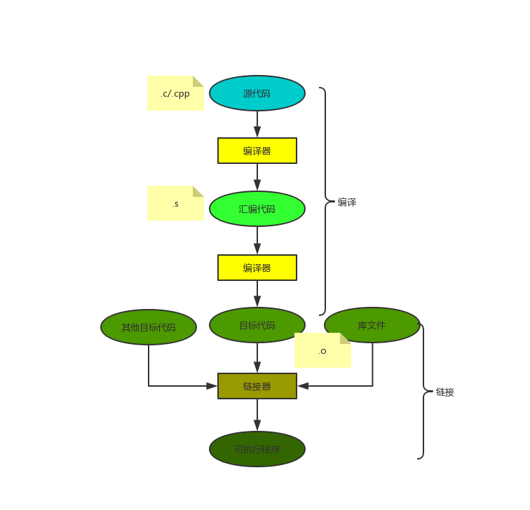
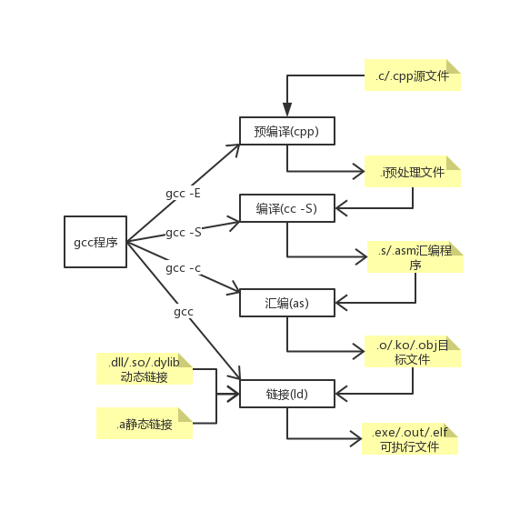
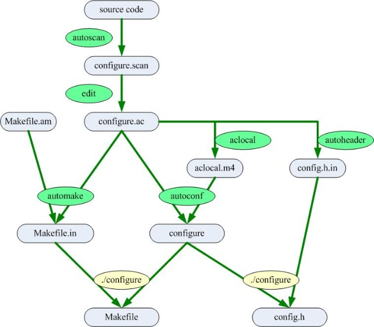

#### 一、c/c++编译过程
c/c++的编译是把c/c++源代码转换成硬件上可以运行的可执行程序。
1. 编译的过程 包括编译和链接两部分
   1. 编译 把文本形式的源代码翻译成机器语言形式的目标文件
      1. 编译 读取源程序，进行词法分析和语法分析，将高级语言转换成等功能的汇编代码
         * 编译预处理 对伪指令(宏指令、条件编译指令、头文件)和特殊符号进行处理
         * 编译、优化  通过词法分析语法分析生成中间代码，并对生成的中间代码优化，优化包括对代码的优化和基于机器硬件结构的优化
      2. 汇编 把汇编语言转换成目标系统的机器指令
         * 目标文件包括代码段和数据段，代码段主要是程序的指令，一般可读和可执行，不可写。数据段存放重续中的全局变量和静态数据，议案可读、可写、可执行
         * 目标文件类型包括可重定位文件（汇编阶段生成）、共享的目标文件、可执行文件
   2. 链接 把目标文件、操作系统的启动代码和用到的库文件进行组织，形成最终的可执行文件。链接的方式包括
      1. 静态链接 一个目标文件的集合，函数的代码从其所在的静态链接库中被拷贝到最终的可执行文件中，目标文件执行时这些代码也会加载到进程的虚拟地址空间
      2. 动态链接 函数的代码位于共享对象或动态链接库中，链接程序此时在最终的可执行程序中记下共享对象的名字以及少量信息，可执行文件执行时动态链接库的全部内容都会被映射到相应进程的虚拟地址空间，动态链接程序根据可执行程序中的记录信息找到相应的函数代码
   3. 编译流程图
      *    
2. gcc编译 
   1. 过程：预编译处理(.c) －－> 编译、优化程序（.s、.asm）－－> 汇编程序(.obj、.o、.a、.ko) －－> 链接程序（.exe、.elf、.axf等
   2. gcc编译过程图
      * 
#### 二、GNU build系统 
大型项目的编译过程往往相当复杂，通常采用某种构建系统来自动化构建

1. 通用的构建过程 如libvad、python3.7等的构建安装
   * 下载程序包
   * ./configure && make && make install
2. 编译一个项目的过程
   1. Configuration 编译参数如系统环境、标准库位置、软件安装位置 通常是由autoconf生成的configure脚本
   2. Standard directory detection 从配置文件中读取标准库函数和头文件位置
   3. Source file dependency calculation 确定源码文件间的依赖关系，./configure脚本生成的makefile文件中
   4. Header file location 头文件定位
   5. Header precompilation 先编译头文件，头文件只会编译一次 
   6. Preprocessing 预处理
   7. Compilation and assembly 源码转换成汇编码
   8. Object file dependency calculation 确定对象文件间的依赖关系
   9.  Linking 链接 在编译器的内存中生成可执行文件 从第4-9 是 make 执行的过程
   10. Installation 把可执行文件拷贝到指定安装目录并设置权限
   11. Resource linking 在操作系统中登记这个程序的元数据、文件名、文件描述、后缀等 10-11步完成make install命令
   12. Package generation 将可执行文件生成安装包
3.  make make在执行时，需要一个命名为Makefile的文件 makefile 用于自动编译和链接，让编译器知道如何执行gcc命令
#### 三、 autotools和cmake 
1. autotools 包括autoscan(是用来扫描源代码目录生成configure.scan文件)、aclocal、autoconf、autoheader、automake等 配合生成Makefile工具。步骤
   1. 运行autoscan命令生成configure.scan
   2. 将configure.scan重命名为configure.ac，并修改configure.ac 文件，利用autoconf提供的各种M4宏，配置项目需要的各种自动化探测项目（重点是AM_INIT_AUTOMAKE和AC_CONFIG_FILES两项，如果没配置的话，下一步的aclocal是无法产生aclocal.m4的）
   3. aclocal 收集configure.ac中用到的各种非Autoconf的宏，生成aclocal.m4，记录了自定义宏的地址
   4. autoheader 扫描configure.ac、acconfig.h生成config.h.in，使程序可移植
   5. 创建Makefile.am，NEWS、AUTHORS、README、ChangeLog文件，按照automake规定的规则和项目的目录结构，编写一个或多个Makefile.am(Makefile.am数目和存放位置和源码目录结构相关)，Makefile.am主要写的就是编译的目标及其源码组成
   6. automake -a 将每个Makefile.am转化成Makefile.in
   7. autoconf 利用M4解析configure.ac，生成shell脚本configure。
   8. ./configure 生成Makefile
   * 
2. cmake
   1. 编写CMakeLists.txt
   2. 执行cmake
3. libfvad为例 地址 git@github.com:dpirch/libfvad.git 
   1. 按照readme 执行 autoreconf、./configure、make、sudo make install 系统中就安装了libfvad.so
   2. 静态链接 需将所有Makefile.am中的编译类型指定为_LIBRARIES，并且在configure.ac中添加AC_PROG_RANLIB 编译中遇到的问题
      1. recompile with -fPIC 。
      
      在gcc 编译是需要添加 -fPIC参数，在生成的Makefile中查找那个CFLAGS，在CFLAGS后添加-fPIC
      有时需要./configure --disable-asm禁用掉asm优化，有些项目会针对64位机器优化，当静态链接一些汇编代码时会报错
   
#### 参考资料
1. GNU-Build-System https://www.gnu.org/software/automake/manual/automake.html#GNU-Build-System
2. GCC and Make Compiling, Linking and Building C/C++ Applications https://www3.ntu.edu.sg/home/ehchua/programming/cpp/gcc_make.html
3. Building C projects http://nethack4.org/blog/building-c.html
4. make学习笔记 https://www.cnblogs.com/machine/archive/2012/11/21/2781508.html
5. 编译器的工作过程 http://www.ruanyifeng.com/blog/2014/11/compiler.html
6. cmcmake与autoconf+automake的对比 autohttp://m.dataguru.cn/thread-177926-1-1.html
7. atools https://www.lrde.epita.fr/~adl/dl/autotools.pdf
8. cmake入门实战 https://www.hahack.com/codes/cmake/
9. 大型项目使用Automake/Autoconf完成编译配置(1)——提纲挈领：https://blog.csdn.net/yunhua_lee/article/details/6172614
10. 大型项目使用Automake/Autoconf完成编译配置(2)--步步为营：https://blog.csdn.net/yunhua_lee/article/details/6172617