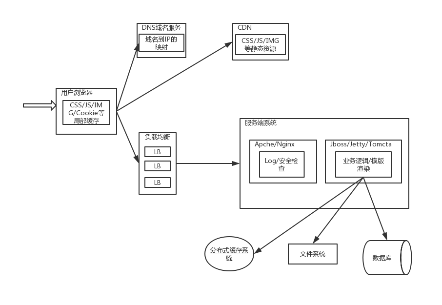

#### WEB
1. 浏览器输入www.taobao.com
   
   1. url交给DNS解析IP
   2. 通过IP向服务器发起请求
   3. 服务器处理请求返回资源  多台服务器先经过负载均衡LB——>nginx  请求的数据存储在数据/分布式缓存
   4. 解析返回的静态资源 JS/CSS/图片 CDN CDN是构建在网络之上的内容分发网络，依靠部署在各地的边缘服务器，通过中心平台的负载均衡、内容分发、调度等功能模块，使用户就近获取所需内容，降低网络拥塞，提高用户访问响应速度和命中率。CDN的关键技术主要有内容存储和分发技术。
2. 发起一个http请求  浏览器输入url/CURL/HttpClient 
   1. DNS解析IP->和IP服务器建立socket连接——>发起请求outputstream.write->inputstream.read读取返回数据->断开连接
3. http 协议
   1. 常见请求头
      1. Accept-Charset 指定客户端的字符集
      2. Accept-Language 指定客户端的语言
      3. Accept-Ecoding 指定客户端的编码
      4. Host 指定被请求资源的主机和端口
      5. User-Agent 客户段的浏览器和操作系统
      6. Connection 当前连接是否保存 keep-alive
   2. 常见的响应头
      1. Server 使用的服务器的名称
      2. Content-Type 指明发送给客户的类型
      3. Content-Encoding
      4. Content-Length
      5. Content-Lannguage
      6. Keep-Alive：保持连接的时间 timeout=5 max=120
   3. 控制缓存机制的http头
      1. cache-control/pragma
         1. public/privete(响应头) nochche(响应头) nostore(响应头) max-age(失效时间响应头) must-revalidation/proxy-revalidation(响应头)
      2. expire 指定过期时间
      3. Last-modified/Etag（根据时间/标示判断过期）
   4. 常见的响应
      1. 200成功 302临时跳转 400客户端请求有语法错误 403服务器收到请求但拒绝服务 404请求的资源不存在 500服务器发生了不可预知的错误
   5. DNS的解析 使用nslookup/dig命令 www.taobao.com 
      1. 浏览器缓存的IP
      2. 如果浏览器缓存的域名，查找操纵系统缓存的域名 /etc/hosts 清除缓存可以使用/etc/init.d/nscd restart Java中的InInnetAddress也会缓存IP
      3. LDNS 操作系统设置的DNS
      4. LDNS没有命中 查询root server域名服务器
      5. root server根据域名返回主域名服务器（gTLD server）
      6. LDNS向gTLD server发出请求
      7. gTLD server查找并返回此域名对一个的name server
      8. Name server 查询域名和IP的映射并返回给LDNSIP和TTL
      9. LDNS 缓存返回的IP和TTL
      10. 解析结果返回用户，用户系统缓存IP和TTL
   6. DNS查询记录
      1. A记录 指定域名对应的IP
      2. MX记录 指定邮箱对应的服务器IP
      3. CNAME记录 指定域名对应的一个或多个别名
      4. NS记录 为域名指定对应的DNS服务器
      5. TXT记录 为主机或域名提供说
   7. CDN原理 内容分发网络，以静态资源为主。用户从主站下载动态数据，然后从CND下载静态数据 核心是在现有网络上添加一层将内容发不到用户的网络边缘
      1. 用户请求一个静态资源 如 cdn.taobao.com  一般主站Api请求和静态资源请求域名不同
      2. 和DNS解析一致，先解析域名，浏览器不存在->LDNS->RootServer root server返回name server 最终通过nameserver解析
      3. name server 会返回公司的DNS解析器，DNS解析服务器将域名CNAME到另一个域名
      4. 另一个域名指向CDN全局中DNS负载均衡器，该GTM返分配给用户最近的CDN节点
      5. 用户去CDN节点获取资源，如果资源不存在再去原站获取
   8. CDN加速 CDN加速就是在CDN的DNS域名解析中选择一个最好的回源
   9. 负载均衡 将工作任务平分到多个操作单元上去
      1. 操作系统负载均衡 利用操作系统的软中断
      2. 链路负载均衡 由DNSserver控制最终访问的web server
      3. 集群负载均衡
         1. 硬件负载 F5 优点性能好 缺点是贵、不易扩展
         2. 软件负载 lvs 四层负载 在网络层对IP分发 HAproxy 七层负载 根据Http的header分发 如cookeie
#### IO
1. javaIO基本架构 核心是数据的格式（字节、字符）和传输的方式（磁盘、网络）
   1. 基于字节的操作 InputStream OutputStream 主要有ByteArray、File、Socket、Filter、Objetc、Piped、Data、Zip、Buffer、Print
   2. 基于字符的操作 Writer Reader 主要有CharArray、Print、Piped、String、Buffered、OutputStream、File （write、read）
   3. 基于磁盘的操作 File
   4. 基于网络的操作 Socket
   5. 字符字节的转化 OutputStreamWriter InputStreamReader
2. 磁盘IO工作机制 IO属于物理设备，应用程序需要通过操作系统调用，但系统调用存在内核空间和用户空间切换的问题，一般系统先从磁盘
   https://www.cnblogs.com/stevenczp/p/7496089.html
   1. 标准访问文件方式
      1. read 读高速缓存-》缓存没有读磁盘-》缓存到高速缓存
      2. write 从用户空间地址写入高速缓存-》（此时用户程序已经结束，高速缓存写入磁盘）
   2. 直接IO方式 应用程序直接从磁盘中取数据 通常出现在数据库管理中，缓存有应用程序控制。缺点是每次直接从磁盘加载很慢
   3. 同步IO方式 与标准访问最大区别是写入时是写入到磁盘才返回应用成功标志
   4. 异步IO方式 访问请求发出后，线程可以去做其他的事而不是阻塞等待，当请求数据完成后，会通知线程成功
   5. 内存映射IO 磁盘空间映射成用户进程空间逻辑地址，应用直接操作指针，指针对应的逻辑地址找不到时，触发缺页中断，从磁盘中加载数据到物理内存，此时指针指向有了物理地址，相比于标准访问少了一次从内核空间向用户空间复制的步骤
3. 序列化 
   1. java serialize 序列化内容是版本、
   2. probuffer
4. 网络IO
   1. TCP/IP https://www.cnblogs.com/Andya/p/7272462.html
   2. Socket TCP三次握手建立连接 InputStream OutPutStream 传输数据
   3. NIO channel selector byteBuffer
   4. 磁盘IO优化 
      1. 性能 iostat IPOS
      2. 缓存减少访问磁盘的次数  应用合理的RAID策略 设计合理的访问数据的策略 优化磁盘的管理系统
   5. TCP优化 开放端口数量 TIME_WAIT时间和数量
   6. 网络IO优化
      1. 减少网络访问次数 网络交互的两段缓存 合并请求
      2. 减小数据传输量的大小
      3. 尽量减少编码、
   7. 同步异步（任务是否等待 同步是一个任务序列 必须等待一个任务完成才能执行另一个任务，） 阻塞非阻塞（CPU是否等待 通常是IO）
   8. 设计模式 适配器模式 装饰者模式
### 编码
1. 编码集合 ASCII 128个字符 ISO-8895 256个字符 GB312 682符号+6763个汉字 GBK